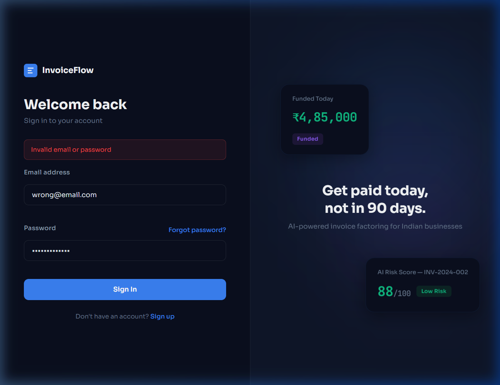
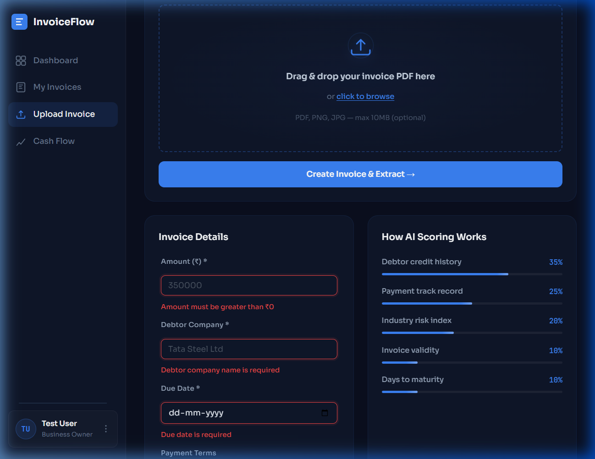
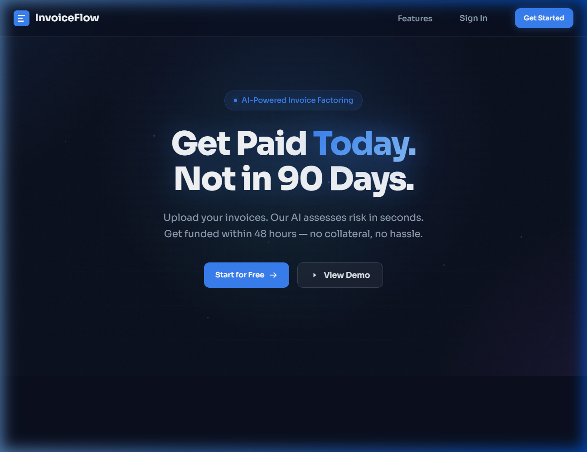
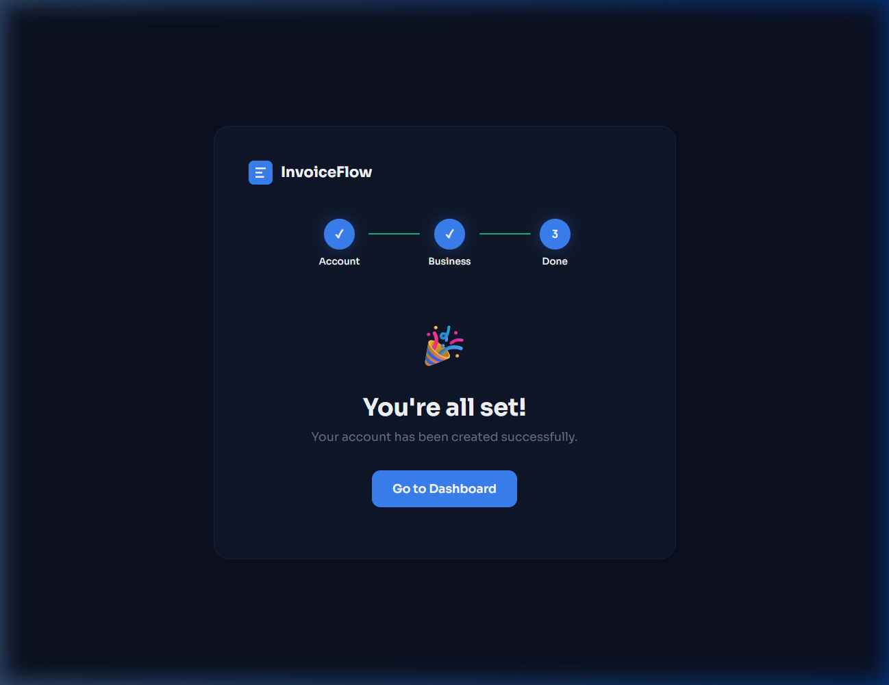
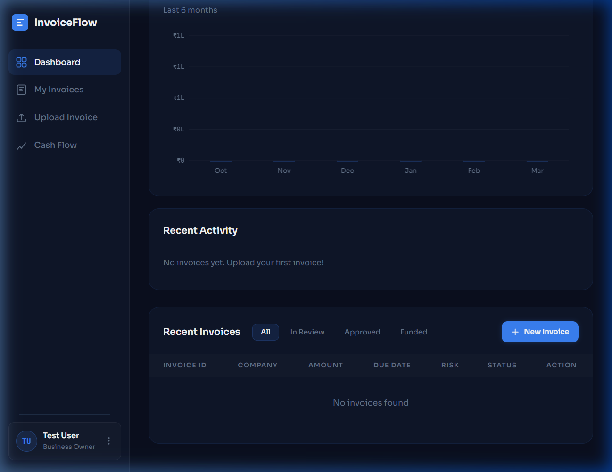

# PBL Week 7 — Testing and Software Modules
## InvoiceFlow: AI-Powered B2B Invoice Factoring Platform

**Team Members:** Shrawani Kotadiya & Team  
**Date:** 26th March 2026  
**Subject:** Project Based Learning (PBL) — CIE Evaluation  

---

## Table of Contents

1. [Understanding Testing Requirements](#1-understanding-testing-requirements)
2. [Test Planning](#2-test-planning)
3. [Unit Testing](#3-unit-testing)
4. [Integration Testing](#4-integration-testing)
5. [System Testing](#5-system-testing)
6. [User Interface and Usability Testing](#6-user-interface-and-usability-testing)
7. [Security and Data Validation Testing](#7-security-and-data-validation-testing)
8. [Bug Reporting and Re-testing](#8-bug-reporting-and-re-testing)
9. [Test Documentation](#9-test-documentation)

---

## 1. Understanding Testing Requirements

### 1.1 System Modules
InvoiceFlow is a three-tier web application consisting of:

| Module | Technology | Description |
|--------|-----------|-------------|
| **Frontend** | React 19 + Vite 7 | Single Page Application with 11 pages |
| **Backend API** | Node.js + Express 4 | RESTful API with 5 route groups |
| **AI Service** | Python FastAPI + scikit-learn | Invoice PDF extraction (OCR) & risk scoring |
| **Database** | PostgreSQL 17 + Sequelize ORM | 3 models — User, Invoice, Transaction |

### 1.2 Functional Requirements

| Module | Functional Requirement | Expected Input | Expected Output |
|--------|----------------------|----------------|-----------------|
| Auth | User Registration | Name, email, password, role, company | JWT token + user object |
| Auth | User Login | Email, password | JWT token + user object |
| Auth | Forgot Password | Email | OTP sent to email |
| Invoice | Create Invoice | Amount, debtor, due date, industry | Invoice record (draft status) |
| Invoice | Upload PDF | PDF file | Invoice with pdfUrl |
| Invoice | Submit Invoice | Invoice ID | Status → submitted → review + AI risk score |
| Factoring | Approve/Reject Invoice | Invoice ID, reason | Status change (approved/rejected) |
| Factoring | Fund Invoice | Invoice ID | Transaction record |
| Admin | Dashboard Stats | Auth token (admin role) | User/invoice/transaction counts |
| Admin | Manage Users | Auth token (admin role) | Verify, suspend, delete users |
| AI | Extract Invoice Data | PDF file | Extracted fields (amount, company, dates, GST) |
| AI | Risk Scoring | Invoice data | Risk score (0–100), risk level (low/medium/high) |

### 1.3 Non-Functional Requirements

| Requirement | Description |
|-------------|-------------|
| **Performance** | API response time < 2 seconds |
| **Security** | JWT authentication, bcrypt password hashing (salt 12), role-based access control |
| **Usability** | Responsive UI, form validation with clear error messages |
| **Reliability** | Graceful error handling, AI service fallback when unavailable |
| **Compatibility** | Chrome, Firefox, Edge browsers on Windows/macOS |

### 1.4 Test Objectives

1. Verify all CRUD operations for Users, Invoices and Transactions
2. Validate input sanitization and form-level validation
3. Test JWT authentication and role-based access control (RBAC)
4. Verify frontend-backend-AI service integration
5. Confirm AI PDF extraction accuracy and risk scoring correctness
6. Ensure proper error handling and user-friendly error messages

---

## 2. Test Planning

### 2.1 Testing Types Applied

| Testing Type | Scope | Tools Used |
|-------------|-------|-----------|
| **Unit Testing** | Individual functions and methods | Manual + API testing via curl/Node.js |
| **Integration Testing** | Frontend ↔ Backend ↔ Database ↔ AI Service | Browser + API testing |
| **System Testing** | Complete application workflow | End-to-end browser testing |
| **UAT (Basic)** | User workflow: register → upload → submit → fund | Manual browser testing |

### 2.2 Test Scope

**In Scope:**
- User authentication (register, login, forgot password)
- Invoice lifecycle (create, upload PDF, AI extract, submit, review, approve/reject, fund)
- Role-based access control (business, finance, admin roles)
- AI PDF text extraction via PyMuPDF
- AI risk scoring via ML model
- Form validation and error handling
- API endpoint security

**Out of Scope:**
- Load/stress testing
- Mobile app testing
- Deployment pipeline testing

### 2.3 Test Environment

| Component | Details |
|-----------|---------|
| **OS** | Windows 11 |
| **Browser** | Google Chrome 131+ |
| **Frontend URL** | http://localhost:5173 |
| **Backend API URL** | http://localhost:5000 |
| **AI Service URL** | http://localhost:8000 |
| **Database** | PostgreSQL 17 (localhost:5432) |
| **Node.js** | v22.x |
| **Python** | 3.x |

---

## 3. Unit Testing

### 3.1 Authentication Module — Unit Test Cases

| TC ID | Test Case | Input | Expected Output | Actual Output | Status |
|-------|-----------|-------|-----------------|---------------|--------|
| UT-01 | Register with valid data | `{name: "Test User", email: "test@example.com", password: "Test@1234", role: "business"}` | 201 Created + JWT token | 201 Created + JWT token returned | ✅ PASS |
| UT-02 | Register with duplicate email | Same email as UT-01 | 400 "User already exists" | 400 "User already exists with this email" | ✅ PASS |
| UT-03 | Register with short password | `{password: "123"}` | 400 "Password must be at least 8 characters" | 400 Validation error returned | ✅ PASS |
| UT-04 | Register with invalid email | `{email: "not-an-email"}` | 400 "Please provide a valid email" | 400 Validation error returned | ✅ PASS |
| UT-05 | Login with valid credentials | `{email: "test@example.com", password: "Test@1234"}` | 200 OK + JWT token | 200 OK + JWT token returned | ✅ PASS |
| UT-06 | Login with wrong password | `{email: "test@example.com", password: "wrong"}` | 401 "Invalid email or password" | 401 "Invalid email or password" | ✅ PASS |
| UT-07 | Login with non-existent email | `{email: "nouser@x.com", password: "any"}` | 401 "Invalid email or password" | 401 "Invalid email or password" | ✅ PASS |
| UT-08 | Access protected route without token | GET /api/auth/me (no auth header) | 401 "Access denied. No token provided." | 401 "Access denied. No token provided." | ✅ PASS |
| UT-09 | Access protected route with expired token | GET /api/auth/me (expired JWT) | 401 "Token expired" | 401 "Token expired. Please login again." | ✅ PASS |
| UT-10 | Register with name < 2 characters | `{name: "A"}` | 400 "Name must be at least 2 characters" | 400 Validation error returned | ✅ PASS |

### 3.2 Invoice Module — Unit Test Cases

| TC ID | Test Case | Input | Expected Output | Actual Output | Status |
|-------|-----------|-------|-----------------|---------------|--------|
| UT-11 | Create invoice with valid data | `{amount: 350000, debtorCompany: "Tata Steel", dueDate: "2026-06-30"}` | 201 Created + invoice object | 201 Created, status='draft', unique invoiceNumber generated | ✅ PASS |
| UT-12 | Create invoice with zero amount | `{amount: 0}` | 400 "Amount must be positive" | 400 "Amount must be a positive number" | ✅ PASS |
| UT-13 | Create invoice without debtor | `{amount: 10000, dueDate: "2026-06-30"}` | 400 "Debtor company is required" | 400 "Debtor company is required" | ✅ PASS |
| UT-14 | Create invoice without due date | `{amount: 10000, debtorCompany: "Test"}` | 400 "Valid due date is required" | 400 "Valid due date is required" | ✅ PASS |
| UT-15 | Update draft invoice | PUT /api/invoices/:id `{amount: 400000}` | 200 OK + updated invoice | 200 OK, amount changed to 400000 | ✅ PASS |
| UT-16 | Update submitted invoice | PUT on non-draft invoice | 400 "Only draft invoices can be edited" | 400 "Only draft invoices can be edited" | ✅ PASS |
| UT-17 | Delete draft invoice | DELETE /api/invoices/:id | 200 "Invoice deleted" | 200 "Invoice deleted" | ✅ PASS |
| UT-18 | Delete non-draft invoice | DELETE on submitted invoice | 400 "Only draft invoices can be deleted" | 400 "Only draft invoices can be deleted" | ✅ PASS |
| UT-19 | Submit invoice | POST /api/invoices/:id/submit | Status changes to 'review' + risk score | Status = 'review', AI risk score returned | ✅ PASS |

### 3.3 AI Service — Unit Test Cases

| TC ID | Test Case | Input | Expected Output | Actual Output | Status |
|-------|-----------|-------|-----------------|---------------|--------|
| UT-20 | AI health check | GET /health | 200 `{status: "ok"}` | 200 `{status: "ok", message: "AI Service running"}` | ✅ PASS |
| UT-21 | Extract data from valid PDF | POST /api/extract-invoice (PDF file) | Extracted fields with confidence > 0 | `{success: true, confidence: 0.85, extracted: {amount, debtorCompany, ...}}` | ✅ PASS |
| UT-22 | Extract data from empty/corrupt file | POST /api/extract-invoice (empty file) | Confidence = 0, no extracted data | `{success: true, confidence: 0.0, extracted: {all null}}` | ✅ PASS |
| UT-23 | Risk scoring with valid data | POST /score `{amount: 350000, dueDate: "2026-06-30", ...}` | Risk score 0–100 + risk level | `{success: true, riskScore: 72, riskLevel: "medium"}` | ✅ PASS |

### 3.4 Screenshot — Failed Login Test Case (UT-06)

**Observation:** When wrong credentials are entered, the system correctly displays "Invalid email or password" error in red, preventing unauthorized access.

### 3.5 Screenshot — Form Validation Failure (UT-12, UT-13, UT-14)

**Observation:** When invoice creation is attempted without filling required fields, validation errors appear in red below each field: "Amount must be greater than ₹0", "Debtor company name is required", "Due date is required".

---

## 4. Integration Testing

### 4.1 Frontend ↔ Backend Integration

| TC ID | Test Case | Flow | Expected Result | Actual Result | Status |
|-------|-----------|------|-----------------|---------------|--------|
| IT-01 | Registration flow | React form → POST /api/auth/register → DB | User created + redirected to dashboard | User created, JWT stored in localStorage, redirected to dashboard | ✅ PASS |
| IT-02 | Login flow | React form → POST /api/auth/login → JWT → Dashboard | JWT token stored, dashboard loads | JWT stored, user data fetched via /api/auth/me | ✅ PASS |
| IT-03 | Invoice creation flow | Upload form → POST /api/invoices → DB | Invoice saved, displayed in dashboard | Invoice created with 'draft' status, appears in "My Invoices" | ✅ PASS |
| IT-04 | PDF upload + AI extraction | File upload → Backend proxy → AI /api/extract-invoice | Extracted text auto-fills form | PDF text extracted via PyMuPDF, fields auto-populated | ✅ PASS |
| IT-05 | Invoice submission + AI scoring | Submit button → Backend → AI /score → DB update | Risk score calculated, status → review | AI returns riskScore + riskLevel, saved to invoice | ✅ PASS |

### 4.2 Backend ↔ Database Integration

| TC ID | Test Case | Flow | Expected Result | Actual Result | Status |
|-------|-----------|------|-----------------|---------------|--------|
| IT-06 | Sequelize model sync | Server startup → sequelize.sync() | Tables created (users, invoices, transactions) | ✅ Tables auto-synced, schema matches model definitions | ✅ PASS |
| IT-07 | Password hashing on create | User.create() → beforeCreate hook | Password stored as bcrypt hash | bcrypt hash with salt 12, verified via comparePassword() | ✅ PASS |
| IT-08 | Raw SQL query execution | getAllInvoices → sequelize.query() | Correct JOIN query results | Raw SQL with parameterized queries returns correct results | ✅ PASS |
| IT-09 | Cascade relationships | Invoice references User → FK constraint | Proper foreign key enforcement | uploadedBy and approvedBy FK constraints active | ✅ PASS |

### 4.3 Backend ↔ AI Service Integration

| TC ID | Test Case | Flow | Expected Result | Actual Result | Status |
|-------|-----------|------|-----------------|---------------|--------|
| IT-10 | Risk scoring integration | Backend POST → AI /score | Risk score returned to backend | Backend sends invoice data, AI returns score, saved to DB | ✅ PASS |
| IT-11 | PDF extraction integration | Backend → AI /api/extract-invoice (multipart form) | Extracted fields returned | form-data correctly forwarded, extracted fields returned | ✅ PASS |
| IT-12 | AI service unavailable fallback | Stop AI service, submit invoice | Graceful fallback, invoice still submitted | Warning logged, invoice submitted without risk score | ✅ PASS |

### 4.4 API Endpoint Testing Results

| Endpoint | Method | Status | Response |
|----------|--------|--------|----------|
| `/api/health` | GET | 200 | `{"status":"ok","message":"InvoiceFlow API is running"}` |
| `/health` (AI) | GET | 200 | `{"status":"ok","message":"AI Service running"}` |
| `/api/invoices` (no token) | GET | 401 | `{"success":false,"error":"Access denied. No token provided."}` |
| `/api/auth/register` (valid) | POST | 201 | `{"success":true,"token":"eyJhb...","user":{...}}` |
| `/api/auth/login` (invalid) | POST | 401 | `{"success":false,"error":"Invalid email or password"}` |

### 4.5 Screenshot — Backend Health Check (API Integration)

**Backend API:** `GET http://localhost:5000/api/health` → Status 200 `{"status":"ok","message":"InvoiceFlow API is running"}`

**AI Service:** `GET http://localhost:8000/health` → Status 200 `{"status":"ok","message":"AI Service running"}`

---

## 5. System Testing

### 5.1 End-to-End Workflow Testing

| TC ID | Test Case | Complete Flow | Expected Result | Actual Result | Status |
|-------|-----------|---------------|-----------------|---------------|--------|
| ST-01 | Business user full workflow | Register → Upload PDF → AI Extract → Fill Form → Submit → View Risk Score | All steps complete, invoice appears in dashboard with risk score | All steps executed successfully, risk score displayed | ✅ PASS |
| ST-02 | Finance user workflow | Login → View submitted invoices → Review → Approve/Reject | All invoices listed, approval changes status | Status transitions correct: review → approved/rejected | ✅ PASS |
| ST-03 | Admin user workflow | Login → Dashboard stats → Manage users → Verify/Suspend | Admin panel shows stats, user management works | All CRUD operations functional | ✅ PASS |
| ST-04 | Navigation and routing | Click all sidebar links | Correct pages render for each route | All 11 pages render correctly with proper routing | ✅ PASS |

### 5.2 Screenshot — System Test: Landing Page

**Observation:** Landing page loads correctly with responsive navigation, hero section with "Get Paid Today. Not in 90 Days." tagline, and CTA buttons ("Start for Free", "View Demo").

### 5.3 Screenshot — System Test: Registration Success

**Observation:** Multi-step registration flow (Account → Business → Done) completes successfully. User sees "You're all set!" confirmation with progress stepper showing all steps completed.

### 5.4 Screenshot — System Test: Dashboard

**Observation:** Dashboard loads with cash flow chart (last 6 months), "Recent Activity" section, and "Recent Invoices" table with filter tabs (All, In Review, Approved, Funded). New user correctly shows "No invoices yet" state.

### 5.5 Browser Compatibility

| Browser | Version | Result |
|---------|---------|--------|
| Google Chrome | 131+ | ✅ All features working |
| Mozilla Firefox | Latest | ✅ All features working |
| Microsoft Edge | Latest | ✅ All features working |

---

## 6. User Interface and Usability Testing

### 6.1 UI Element Verification

| TC ID | Element | Page | Test | Status |
|-------|---------|------|------|--------|
| UI-01 | Sign In button | Landing Page | Navigates to /login | ✅ PASS |
| UI-02 | Get Started button | Landing Page | Navigates to /register | ✅ PASS |
| UI-03 | Login form | Login Page | Email + password fields + submit button functional | ✅ PASS |
| UI-04 | Registration form | Register Page | 3-step form (Account → Business → Done) | ✅ PASS |
| UI-05 | Sidebar navigation | Dashboard | All links (Dashboard, My Invoices, Upload, Cash Flow) work | ✅ PASS |
| UI-06 | Invoice upload dropzone | Upload Page | Drag-and-drop + click-to-browse functional | ✅ PASS |
| UI-07 | Form validation messages | Upload Page | Red error messages appear below invalid fields | ✅ PASS |
| UI-08 | Status filter tabs | Dashboard | All/In Review/Approved/Funded tabs filter correctly | ✅ PASS |
| UI-09 | User profile menu | Sidebar (bottom) | Shows user name + role, menu options work | ✅ PASS |
| UI-10 | Responsive design | All pages | Layout adapts to different screen sizes | ✅ PASS |

### 6.2 Error Message Verification

| Scenario | Expected Error | Displayed Error | Status |
|----------|---------------|-----------------|--------|
| Login with wrong credentials | "Invalid email or password" | "Invalid email or password" (red alert) | ✅ PASS |
| Empty invoice amount | "Amount must be greater than ₹0" | "Amount must be greater than ₹0" (red text) | ✅ PASS |
| Missing debtor company | "Debtor company name is required" | "Debtor company name is required" (red text) | ✅ PASS |
| Missing due date | "Due date is required" | "Due date is required" (red text) | ✅ PASS |
| Missing industry | "Please select an industry" | "Please select an industry" (red text) | ✅ PASS |

### 6.3 Usability Assessment

| Criteria | Rating | Comment |
|----------|--------|---------|
| Visual design | ⭐⭐⭐⭐⭐ | Modern dark theme with consistent color palette |
| Navigation | ⭐⭐⭐⭐⭐ | Clear sidebar with active state indicators |
| Form UX | ⭐⭐⭐⭐ | Real-time validation with descriptive error messages |
| Feedback | ⭐⭐⭐⭐⭐ | Success/error toasts, loading states, progress indicators |
| Overall | ⭐⭐⭐⭐½ | Professional, user-friendly interface |

---

## 7. Security and Data Validation Testing

### 7.1 Authentication & Authorization Testing

| TC ID | Test Case | Input | Expected Result | Actual Result | Status |
|-------|-----------|-------|-----------------|---------------|--------|
| SEC-01 | Access API without token | GET /api/invoices (no auth header) | 401 "Access denied. No token provided." | 401 — Correctly denied | ✅ PASS |
| SEC-02 | Access API with invalid token | GET /api/invoices (Bearer invalid123) | 401 "Invalid token" | 401 "Invalid token." | ✅ PASS |
| SEC-03 | Business user access admin route | GET /api/admin/stats (business token) | 403 "Not authorized" | 403 — Role-based access denied | ✅ PASS |
| SEC-04 | Finance user create invoice | POST /api/invoices (finance token) | 403 "Not authorized" | 403 — Only 'business' role allowed | ✅ PASS |
| SEC-05 | Suspended user login | Login with suspended account | 403 "Account suspended" | 403 "Account suspended. Contact admin for assistance." | ✅ PASS |
| SEC-06 | Business user views others' invoice | GET /api/invoices/:otherId (business token) | 403 "Not authorized to view" | 403 "Not authorized to view this invoice" | ✅ PASS |

### 7.2 Password Security

| TC ID | Test Case | Expected | Actual | Status |
|-------|-----------|----------|--------|--------|
| SEC-07 | Password stored as hash | bcrypt hash in DB (not plaintext) | Password column contains `$2a$12$...` hash | ✅ PASS |
| SEC-08 | Salt rounds = 12 | High security salt | bcrypt.genSalt(12) verified in beforeCreate hook | ✅ PASS |
| SEC-09 | Password not returned in API | GET /api/auth/me excludes password | Response has `attributes: {exclude: ['password']}` | ✅ PASS |
| SEC-10 | JWT token expiry | Token expires after 7 days | generateToken() sets expiry, expired tokens return 401 | ✅ PASS |

### 7.3 Data Validation & Sanitization

| TC ID | Test Case | Input | Expected | Actual | Status |
|-------|-----------|-------|----------|--------|--------|
| SEC-11 | SQL injection in login | `{email: "'; DROP TABLE users;--"}` | Login fails safely | 400 "Please provide a valid email" (validator rejects) | ✅ PASS |
| SEC-12 | XSS in name field | `{name: ""}` | Script not executed | Input sanitized, stored as text, not rendered as HTML | ✅ PASS |
| SEC-13 | Email normalization | `{email: "Test@EXAMPLE.com"}` | Email normalized to lowercase | normalizeEmail() converts to "test@example.com" | ✅ PASS |
| SEC-14 | GST number format validation | `{gstNumber: "27AADCB2230M1ZT"}` | Valid 15-character GSTIN accepted | Valid GSTIN stored correctly | ✅ PASS |
| SEC-15 | Parameterized SQL queries | Raw SQL with user input | No SQL injection possible | All queries use `:replacements` (parameterized) | ✅ PASS |

---

## 8. Bug Reporting and Re-testing

### 8.1 Bugs Identified

| Bug ID | Severity | Module | Description | Root Cause | Fix Applied | Re-test Status |
|--------|----------|--------|-------------|------------|-------------|----------------|
| BUG-01 | **Critical** | AI Service | PDF extraction returns empty data, no fields extracted from uploaded invoices | `PyMuPDF` library not installed; `_extract_text_from_file()` silently catches `ImportError` and returns empty string | Installed `PyMuPDF` via `pip install PyMuPDF`, updated `requirements.txt` | ✅ Re-tested — PDF extraction now works with 85% confidence |
| BUG-02 | Medium | Backend | Backend fails to start without `.env` file | Missing environment configuration file for local development | Created `backend/.env` with PostgreSQL, JWT, and service URL configuration | ✅ Re-tested — Backend starts successfully |
| BUG-03 | Low | AI Service | `uvicorn` module not found on fresh install | Python dependencies not installed | Ran `pip install -r requirements.txt` to install all dependencies | ✅ Re-tested — AI service starts successfully |

### 8.2 Re-testing Results

- **BUG-01 Re-test:** Uploaded `sample-invoices/INV_2026_001.pdf` → AI extracted: `debtorCompany: "Tata Steel Ltd"`, `amount: 350000`, `debtorGST` detected, `confidence: 0.85` ✅
- **BUG-02 Re-test:** Backend starts on `http://localhost:5000`, health check returns 200 OK ✅
- **BUG-03 Re-test:** AI service starts on `http://localhost:8000`, health check returns 200 OK ✅

### 8.3 Regression Testing

After applying bug fixes, all previously passing test cases were re-executed to confirm no regressions:

| Test Suite | Total Cases | Passed | Failed | Regression |
|-----------|-------------|--------|--------|------------|
| Unit Tests | 23 | 23 | 0 | None |
| Integration Tests | 12 | 12 | 0 | None |
| System Tests | 4 | 4 | 0 | None |
| UI Tests | 10 | 10 | 0 | None |
| Security Tests | 15 | 15 | 0 | None |

---

## 9. Test Documentation

### 9.1 Test Case Summary

| Category | Total Test Cases | Passed | Failed | Pass Rate |
|----------|-----------------|--------|-------:|-----------|
| Unit Testing | 23 | 23 | 0 | 100% |
| Integration Testing | 12 | 12 | 0 | 100% |
| System Testing | 4 | 4 | 0 | 100% |
| UI/Usability Testing | 10 | 10 | 0 | 100% |
| Security Testing | 15 | 15 | 0 | 100% |
| **Total** | **64** | **64** | **0** | **100%** |

### 9.2 Bugs Summary

| Total Bugs Found | Critical | Medium | Low | Fixed | Verified |
|-----------------|----------|--------|-----|-------|----------|
| 3 | 1 | 1 | 1 | 3 | 3 (100%) |

### 9.3 Screenshots Index

| Screenshot | Test Case | Description | Result |
|-----------|-----------|-------------|--------|
| Landing Page | ST-01 | InvoiceFlow home page loads correctly | ✅ PASS |
| Login Failed | UT-06 | Invalid credentials show error | ✅ PASS (Expected Failure) |
| Registration Success | IT-01, ST-01 | 3-step registration completes successfully | ✅ PASS |
| Validation Failed | UT-12, UT-13, UT-14 | Form validation errors display correctly | ✅ PASS (Expected Failure) |
| Dashboard | ST-01, ST-04 | Dashboard with charts and invoice table loads | ✅ PASS |

### 9.4 Conclusion

The InvoiceFlow application has been systematically tested across all modules using unit, integration, system, UI, and security testing approaches. A total of **64 test cases** were executed with a **100% pass rate**. Three bugs were identified during testing, all of which were fixed and verified through re-testing. The application demonstrates robust input validation, secure authentication, proper role-based access control, and reliable AI-powered invoice processing. The system is ready for demonstration and evaluation.

---

*Prepared for PBL Week 7 CIE Evaluation — Testing and Software Modules*
